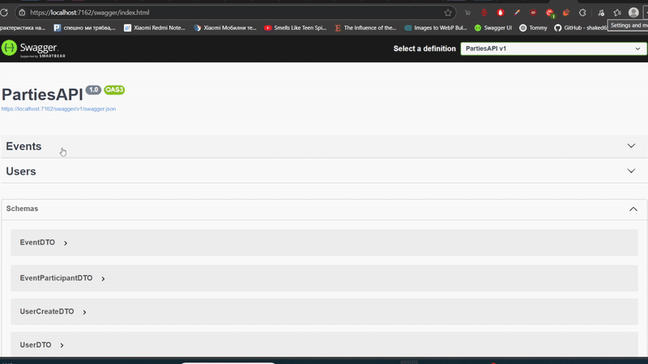

# 🎉 Parties API  
> A lightweight ASP.NET Core Web API for managing parties and their members.

 <!-- Replace with your actual GIF path -->

---

## 🧭 Overview

The **Parties API** allows clients to create and manage:

- 🥳 Parties  
- 👤 Members  

It’s designed as a learning project or template for building clean, minimal APIs with .NET Core.

---

## 🛠️ Technologies Used

- ASP.NET Core 7 Web API  
- Swagger  
- Minimal DB usage (free MySQL instance or local setup)  
- Basic RESTful principles  
- CORS for client-side communication  

---

## 📸 API Preview

> Here’s a preview of the available endpoints in Swagger:

---

## ⚙️ Local Setup

This project uses a private MySQL database hosted externally and is not publicly available.  
If you're interested in running the API locally or testing it fully, feel free to reach out!

---

## 📩 Contact
💡 **Developer:** Desislav Pavlov  
📧 **Email:** makotashako@gmail.com  
🐙 **GitHub:** [DesislavPavlov](https://github.com/DesislavPavlov)  
🔗 **LinkedIn:** [Desislav Pavlov](https://www.linkedin.com/in/developer-d-pavlov/)

